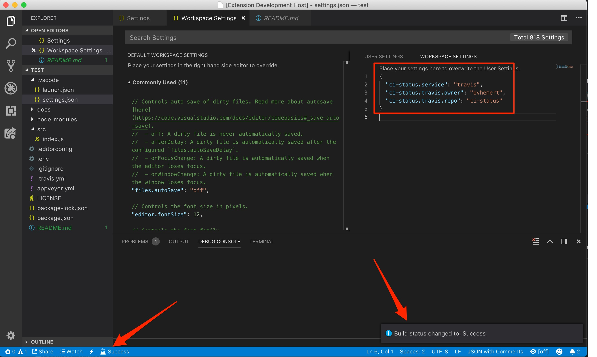

# CI Build Status

This extension shows you the build status of your project.

## Features

When the build status changes, a notification message will popup.

The current status is always visible in the statusbar.



## Requirements

The extension currently supports projects built on Appveyor, Jenkins and Travis CI.

## Extension Settings

Supported settings differ per service. You first have to specify which service to use:

```js
// the service to check
"ci-status.service": "appveyor"
```

### AppVeyor

```js
"ci-status.service": "appveyor"
// User account the repositories belong to (required)
"ci-status.appveyor.owner": "ovhemert",
// The name of the repository your interested in (required)
"ci-status.appveyor.repo": "ci-status"
```

### AWS Codepipeline

```js
"ci-status.service": "codepipeline"
// The name of the pipeline you're interested in (required)
"ci-status.codepipeline.name": "test-project-pipeline",
// The AWS region in which your pipeline resides (required)
"ci-status.codepipeline.region": "us-east-1"
```

### Jenkins

```js
"ci-status.service": "jenkins"
// The name of the project your interested in (optional)
"ci-status.jenkins.project": "ci-status"
// The host url to connect to (required)
"ci-status.jenkins.url": "http://localhost:8080/"
// API token (preferred) / password of the user for authentication (required)
"ci-status.jenkins.token": "116237544ebea73f9a27ffebadb3961859"
// User account name to connect with (required)
"ci-status.jenkins.user": "ovhemert"
```

### Travis CI

```js
"ci-status.service": "travis"
// Show build status for specific branch (optional)
"ci-status.travis.branch": "production"
// User account the repositories belong to (required)
"ci-status.travis.owner": "ovhemert"
// The name of the repository your interested in (optional)
"ci-status.travis.repo": "ci-status"
// API token (preferred) / password of the user for authentication (optional)
"ci-status.travis.token": "116237544ebea73f9a27ffebadb3961859"
```
